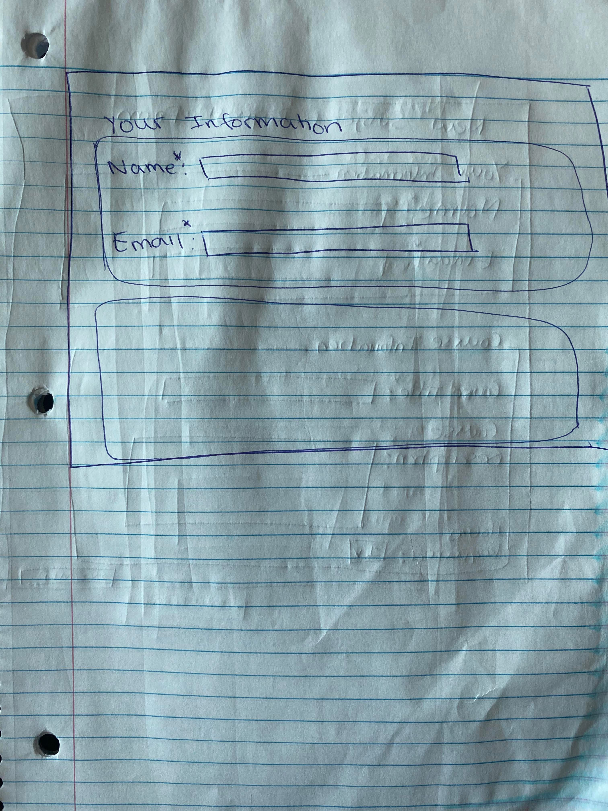

# Project 3: Design Journey

**For milestones, complete only the sections that are labeled with that milestone.**

Be clear and concise in your writing. Bullets points are encouraged.

**Everything, including images, must be visible in Markdown Preview.** If it's not visible in Markdown Preview, then we won't grade it. We won't give you partial credit either.

**Make the case for your decisions using concepts from class, as well as other design principles, theories, examples, and cases from outside of class.**

You can use bullet points and lists, or full paragraphs, or a combination, whichever is appropriate. The writing should be solid draft quality but doesn't have to be fancy.

## Project 1 or Project 2
> Which project will you add a form to?

Project 1

## Audience (Milestone 1)
> Who is your site's target audience? This should be the original audience from Project 1 or Project 2. You may adjust the audience if necessary. Just make sure you explain your rationale for doing so here.

The first intended audience is **high school students studying IB or IGCSE subjects**, since these will be
the clients that I intend to reach.  My other target audience will be **parents with children who are currently studying the IB or IGCSE**. This is because some parents may wish to find a tutor for their child. This audience will be most interested in testimonials from other students as well as the pricing of my classes. My design goal for this audience is a site that looks professional.

## Audience's Needs (Milestone 1)
> List the audience's needs that you identified in Project 1 or 2. Just list each need. No need to include the "Design Ideas and Choices", etc. You may adjust the needs if necessary. However, any changes you make to the needs for this project should be clearly identified and justified.

- Need 1: Background information about me to get a sense of my personality and academic acheivements
- Need 2: In depth explanation of the courses I offer
- Need 3: An explanation of how my tutoring caters perfectly to each students academic needs
- Need 4: An understanding of how good I am at tutoring
- Need 5: Prices for each of the courses I teach
- Need 6: The ability to contact me with questions or feedback

## HTML Form + User Needs Brainstorming (Milestone 1)
> Using the audience needs you identified, brainstorm possible options for an HTML form for the site. List each idea and provide a brief rationale for how the HTML form addresses that need.

- The first possible option for a HTML form for this site is a feedback form that asks users about their experience with having me as a tutor. This would address Need 1, since the form allows students to provide me with anonoymous constructive feedback such that I can improve my teaching/tutoring style.
- The second possible option for a HTML form is a subcription form that allows users to subcribe to my newsletter and blog posts. This addresses need 1 and need 2, since subscribing to my news letter and blog posts will allow users to get even more information delivered to their email about me and about updates to my services.
- The third possible option for a HTML form is a new subject request form which will allow users to request a new subject that they would like me to provide tuition for. This addresses need 4, since the form gives potential students an opportunity to get tutoring that perfectly caters to their academic needs.

## HTML Form Proposal & Rationale (Milestone 1)
> Make a decision about your site's form. Describe the purpose of your proposed form for your Project 1 or 2 site. Provide a brief rationale explaining how your proposed form meets the needs of your site's audience.
> Note: If your form is a contact form, we expect to see a thorough justification explaining how a contact form addresses the user's _actual_ needs. In your justification explain how a contact form better suits the needs of your user compared to the alternatives (e.g. sending you an email using your email address).

Form Proposal: The form I will be designing for my personal tutoring website (project 1) is a new subject request form. The form will ask users what the subject is titled, a brief description of what is taught in the class, what kinds of materials they would like me to provide, how many hours a week they will expect to be tutored for this subject, and their current grade for the subject (if applicable).
User Needs Rational: Since one of the main needs for my target audience of high school students is to provide them with best quality tutoring that caters to their academic needs and requirements, the form will allow me to tailor my courses and teaching to exactly match what their academic needs are.

## Form User Data (Milestone 1)
> Think through and plan the data you need to collect from the users. Do you need their name? Email address? etc.

For this form, I will need the following pieces of data:
- Name
- Email
- Requested course title
- A brief description of what the course is about/the material covered in the course
- Approximately how many hours of tuition a week the student expects they will need for this course

## Form Components & Validation Criteria (Milestone 1)
> For each piece of data you plan to collect from the users, identify an appropriate HTML component to collect that data and decide the validation criteria (e.g. whether this data is _required_). Briefly explain your reasoning for the component choice and the validation criteria.

- **Name (required)**: text field; `<input type="text">`
  - I chose this component because since the users name should not include any line breaks, if the user enters line breaks this component type removes the breaks before sending the data to the server. This input type is required because I will need to know who I am providing this service for.
- **Email (required)**: email field; `<input type="email">`
  - I chose this component because since it automatically validates to ensure that it is either empty or a properly formatted email address, it will ensure that the users types in an appropriate email.  This input is required because I will need to be able to contact the student to let them know whether I will be able to provide the course or not
- **Requested course title (required)**; `<input type="text">`
  - This component is the most appripriate because the course title should be only 1 line and should not contain any line breaks. Required because I need to this minimal information in order to actually prepare the course for the student
- **Brief description of the materials covered in the course (optional)**; `<input type="<textarea>`
  - I chose this component because the user might need to provide a lot of text that includes line breaks. This input is not required because some students may not have a lot of information about the course yet. For example, if a student expects to be taking that class in the following semester, they won't know what materials are covered in the course yethb
- **Approx how many hours of tuition a week the student will need: (optional)**; `<input type="<number>`
  - This component is the most appripriate because I want to contrain the users input such that they can only enter a numerical value. This value is optional because some users may not have any idea how many hours of tuition they may need for this new class, especially if they haven't started the course yet.

## Form Location (Milestone 1)
> Which HTML file will you place your form?

TODO (new-subject-request.html)

> Sketch the location of the form in that page. This sketch need not be fancy. You don't need to provide many details of the page or form. Just plan the location of the form on the page and communicate that to us. You can literally have a box that says "FORM HERE."

**Desktop Location**

**Mobile Location**

TODO

## Form Design (Milestone 1)
> Include sketches on your form below. Include sketches of your **mobile and desktop** versions without corrective feedback. Show us the evolution of your design and the alternatives you considered.

**Desktop Sketches**

This was the first sketch of the desktop version of my form. In this initial sketch, I wanted to keep the form very professional and simplistic, since this is the overall theme of my website. However, after some contemplation, I realized that my audiences might be confused by the 'Name' label and accidentally think that it is asking for the name of the new subject, instead of their name. Therefore, I decided to make another sketch.

The first thing I wanted to do while making this next sketch was to make it clear to my users that the name and email labels are referring to their personal information. The first way I thought of doing this was to create 2 seperate boxes, each with a heading on top of the box that specifies that the content in the first box is the users personal information, and the content in the second box is the course information. While I thought this sketch definitely made things clearer for my audiences than the first sketch, I was still not quite satisfied with this sketch, and wanted to find a better way to make this clear to users.

**Mobile Sketches**

TODO

## Form Feedback Design (Milestone 1)
> Include sketches of your **mobile and desktop** with _corrective feedback_. Show us the evolution of your design and the alternatives you considered.

**Desktop Feedback**

TODO

**Mobile Feedback**

TODO

## Form Implementation Planning (Milestone 1)
> What submission method will your form use? GET or POST. Explain your reasoning.

I will be using post, since the data includes sensentive information

> For your site's `<form>` element, plan all HTML attributes that you will need and their values. Hint: action=, method=, novalidate

- `method="post"`
- `action=https://www.cs.cornell.edu/courses/cs1300/2020fa/submit.php`
- `novalidate`
-`input type="text"`
-`input type="textarea"`
-`input type="email"`
-`input type="number"`
-

## Additional Information (Milestone 1)
> (optional) Include any additional information, justifications, or comments we should be aware of.

TODO

## Plan Validation Pseudocode (Final Submission)
> Write your form validation pseudocode here.

When form is submitted:
if name data is valid:
  hide name feedback
else:
  show name feedback

if email is valid:
  hide email feedback
else:
  show email feedback

if requested course title data is valid:
  hide requested course title feedback
else:
  show requested course title feedback

if form data is valid:
  send data to server
else:
  prevent form from sending data to server

## Additional Design Justifications (Final Submission)
> If you feel like you haven’t fully explained your design choices in the final submission, or you want to explain some functions in your site (e.g., if you feel like you make a special design choice which might not meet the final requirement), you can use the additional design justifications to justify your design choices. Remember, this is place for you to justify your design choices which you haven’t covered in the design journey. Use it wisely. However, you don’t need to fill out this section if you think all design choices have been well explained in the final submission design journey.

TODO

## Self-Reflection (Final Submission)
> This was the first project in this class where you coded some JavaScript. What did you learn from this experience?

TODO

> Reflect on how HTML, CSS, and JavaScript together support client-side interactivity. If it's helpful, you can describe your mental model of client-side interactivity or explain how the general idea of showing and hiding content can be used to implement other forms of client-side interactivity beyond form validation and feedback.

TODO

> Take some time here to reflect on how much you've learned since you started this class. It's often easy to ignore our own progress. Take a moment and think about your accomplishments in this class. Hopefully you'll recognize that you've accomplished a lot and that you should be very proud of those accomplishments!

TODO
